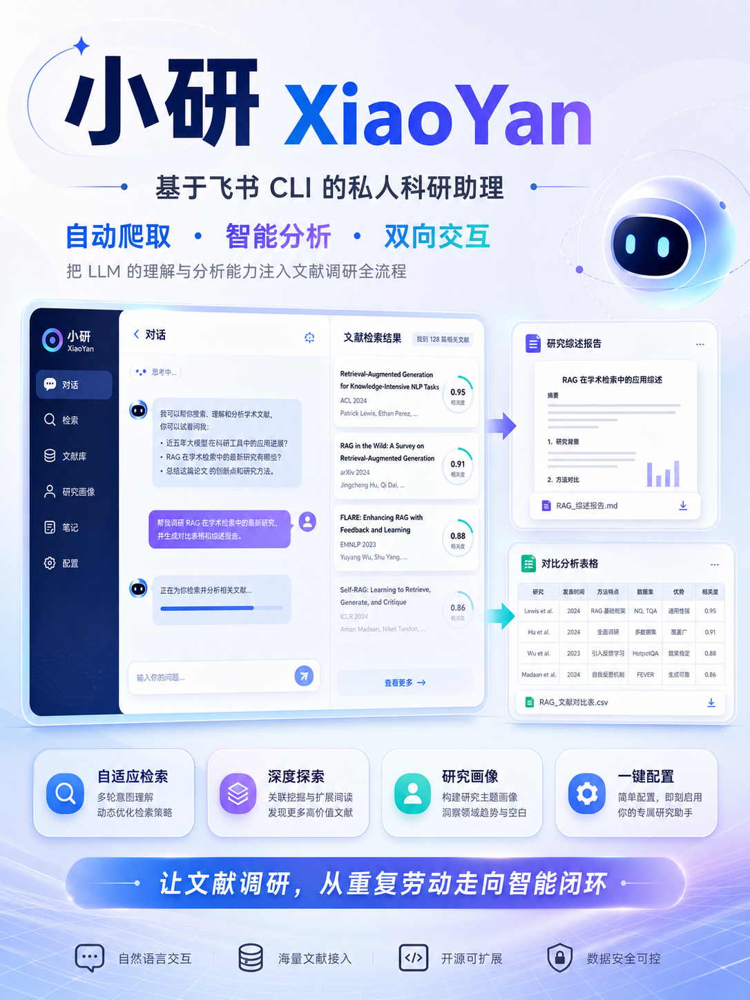
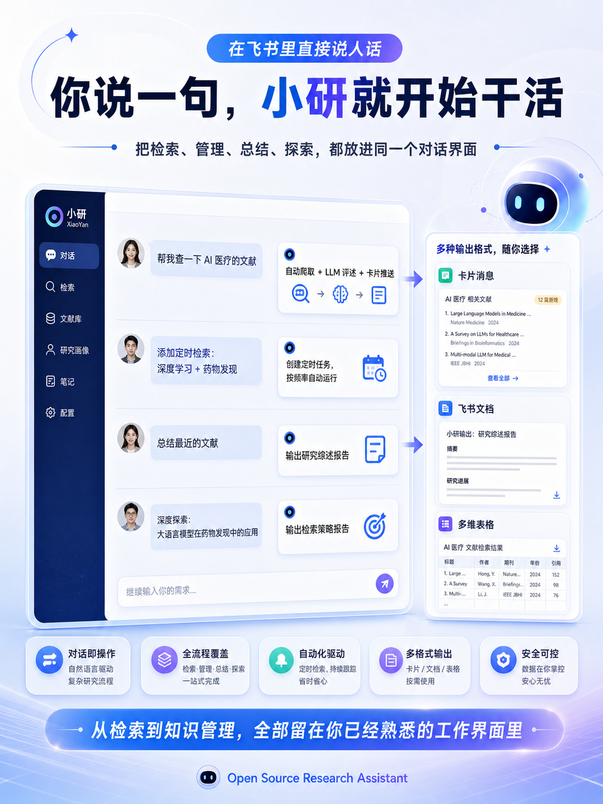
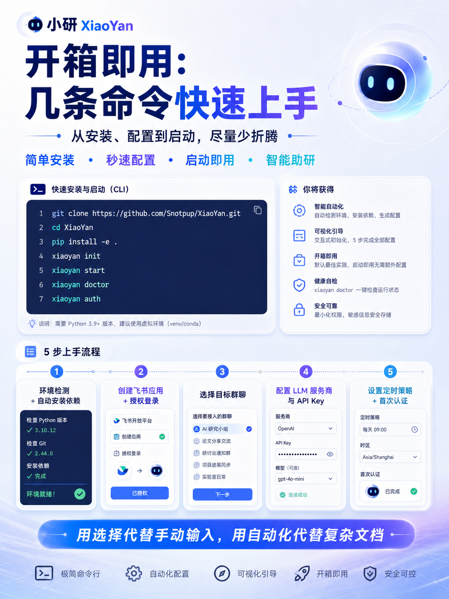

# 小研 (XiaoYan)

> 基于飞书 CLI 的私人科研助理 — 自动爬取、智能分析、双向交互

<p align="center">
  
</p>

## 解决什么问题

科研工作者的日常文献调研存在几个反复出现的痛点：

1. **重复劳动**: 每天手动打开知网/WoS、输入检索式、翻页浏览、逐篇筛选——同样的流程反复执行
2. **信息过载**: 一次检索动辄上千结果，人工筛选效率低，容易遗漏关键文献
3. **工具割裂**: 文献检索在浏览器、讨论在飞书、笔记在文档——信息分散在多个工具间
4. **检索质量依赖经验**: 检索式写得好不好直接决定结果质量，但大多数人只会用最基础的关键词组合

小研的思路是：把 LLM 的理解和分析能力注入到文献调研的每个环节——从检索式的生成优化、到结果的智能筛选评述、再到报告的自动撰写——然后通过飞书把这一切送到你已经在用的工作界面里。

<p align="center">
  
</p>

## 功能特性

### 双向交互：主动推送 + 自然语言操控

| 模式 | 说明 | 你的操作 |
|------|------|----------|
| **主动推送** | 定时爬取 → LLM 筛选评述 → 飞书卡片推送 | 设好频率后不用管，小研自己跑 |
| **被动响应** | 飞书发一句话 → 意图识别 → 执行检索/管理 → 反馈结果 | 在飞书里直接说人话就行 |

两种模式互补：定时任务保证不漏掉新文献，即时指令处理临时需求。所有交互都在飞书内完成，不需要切换到任何其他工具。

### 自适应检索引擎

这是小研的核心能力。传统检索是"一次查询，人工翻页"；小研的做法是让 LLM 闭环参与整个检索过程：

```
用户描述研究主题 (自然语言)
        ↓
   LLM 生成初始检索式
        ↓
   爬虫执行 → 获取结果
        ↓
   LLM 评估标题相关性 (0~100%)
        ↓
   ┌─ 相关率达标 → 推送结果
   ├─ 结果过多/过少 → LLM 优化检索式，再来一轮
   └─ 连续无改善 → 推送历史最佳结果
        ↓
   最多 10 轮自动迭代
```

每一轮都会向飞书实时推送进展（当前轮次、检索式、结果数、相关率），用户能清楚看到检索策略是怎么一步步收敛的。

这个闭环解决了"检索式质量依赖经验"的问题——即使你不熟悉 WoS 的 `TS=` 语法或知网的专业检索，只要能用自然语言描述研究方向，小研就能帮你生成合理的检索式并在迭代中自动优化。

<p align="center">
  
</p>

### 深度探索模式

当研究方向还不明确、需要全面摸底时，深度探索模式会执行一个三阶段流程：

1. **课题分解**: LLM 将研究主题拆解为核心概念和子方向
2. **多维度探测**: 为每个子方向生成独立的检索式，逐个执行并收集结果（最多 10 轮，含收敛检测）
3. **策略报告**: 汇总所有探测结果，生成包含推荐检索策略、分类发现和研究建议的完整报告

报告自动创建为飞书文档，可直接写入个人知识库。

### 飞书深度集成

基于飞书官方 CLI 工具 (`lark-cli`) 构建，所有飞书交互通过 CLI 子进程调用实现：

| 飞书能力 | lark-cli 命令 | 小研的用途 |
|----------|--------------|-----------|
| 消息事件监听 | `event +subscribe` | 实时接收用户在飞书中发的指令 |
| 消息发送/回复 | `im message send/reply` | 推送检索结果、回复操作确认 |
| 交互卡片 | 消息卡片模板 | 结构化展示文献信息 (标题/期刊/摘要/LLM 评述) |
| 文档创建 | `docx create` | 文献分析报告自动生成为飞书文档 |
| 多维表格 | Bitable API | 文献数据同步到表格，便于筛选和管理 |

这种"CLI 子进程"的集成方式让 Python 端只需管理子进程生命周期和解析 JSON 输出，无需处理飞书开放平台的 OAuth 流程、API 签名、Webhook 注册等复杂细节。

<p align="center">
  
</p>

### 研究画像

小研会通过日常交互逐步学习你的研究方向。当你闲聊时提到"我主要做 NLP 方向"，小研会自动提取并记住这个偏好。后续检索时，画像信息会被注入到 LLM 的上下文中，影响检索式的生成和结果的筛选——让你的研究方向越用越精准。

画像以结构化数据存储在本地，你可以随时查看和调整。

### 一键配置

`xiaoyan init` 一条命令完成全部配置，5 个阶段全程交互式引导：

| 阶段 | 做什么 | 用户操作 |
|------|--------|----------|
| Phase 1 | 环境检测 + 自动安装依赖 (Node.js/lark-cli/Playwright) | 无 |
| Phase 2 | 创建飞书应用 + 授权登录 | 浏览器中点击 1 次 |
| Phase 3 | 选择目标群聊 | 选一个序号 |
| Phase 4 | LLM 配置 (预设 DeepSeek/智谱/通义/OpenAI) | 选服务商 + 填 Key |
| Phase 5 | 定时策略 + 首次爬虫认证 | 选频率 + 通过验证码 |

设计原则：用"选择"代替"手动输入"，用"自动检测安装"代替"读文档照着做"。

## 亮点与创新

### 1. LLM 闭环检索——不只是"搜完再总结"

大多数学术工具对 LLM 的使用停留在"检索完成后用 LLM 写个摘要"。小研把 LLM 嵌入了检索本身的闭环：每一轮检索结果都会经过 LLM 的相关性评估，评估结果驱动检索式的自动优化，直到结果质量达标或策略收敛。这意味着 LLM 不是事后分析者，而是检索过程的实时决策者。

<p align="center">
  
</p>

### 2. CLI 子进程架构——用最轻的方式接最深的集成

飞书开放平台的 API 对接涉及 OAuth 签名、Webhook 注册、事件加解密等大量工程细节。小研另辟蹊径：所有飞书交互都通过官方 `lark-cli` 的子进程调用完成——Python 端只需要 `subprocess` 管理进程、逐行读取 stdout 的 NDJSON。这让飞书接入层的代码量减少了约 70%，同时获得了飞书官方 CLI 的全部能力（事件订阅、IM 消息、文档创建、多维表格）。

### 3. 课题分解 + 多维度探测——从"搜一个点"到"扫一个面"

深度探索模式不是简单地多搜几次。它先用 LLM 将研究课题分解为多个核心概念和子方向，再为每个方向独立生成检索式并执行，最后汇总所有探测结果生成结构化的检索策略报告。整个过程包含收敛检测（连续 3 轮结果变化 ≤20% 自动终止）和重复检索式去重，避免无效迭代。

### 4. 越用越懂你的研究画像

小研不是每次对话都从零开始。它通过日常交互自动提取你的研究偏好（方向、关注领域、常用平台），形成结构化的研究画像。画像信息会注入到后续每次 LLM 调用的上下文中，影响检索式的生成、结果的筛选和报告的侧重——随着使用次数增加，小研对你的研究方向理解会越来越准确。

### 5. 从检索到知识管理的完整闭环

小研覆盖了文献调研的完整链路：检索式管理 → 自动爬取 → LLM 评述筛选 → 飞书卡片推送 → 文献报告生成 → 飞书文档/多维表格沉淀。用户不需要在知网、WoS、飞书、笔记软件之间来回切换——一个飞书群聊就是全部工作界面。

## 快速开始

### 1. 安装

```bash
git clone https://github.com/Snotpup/XiaoYan.git
cd XiaoYan
pip install -e .
```

### 2. 一键配置

```bash
xiaoyan init
```

`xiaoyan init` 会自动完成以下所有步骤：

| 步骤 | 说明 | 你需要做什么 |
|------|------|-------------|
| 环境检测 | 检查 Node.js、Python 依赖 | 无 (自动) |
| 安装 lark-cli | `npm install -g @larksuite/cli` | 无 (自动) |
| 安装 Chromium | Playwright 浏览器引擎 | 无 (自动) |
| 创建飞书应用 | 打开浏览器引导创建 | 按提示操作 (1 次) |
| 飞书授权 | 打开浏览器授权登录 | 点击「授权」(1 次) |
| 选择群聊 | 自动列出群聊供选择 | 选一个序号 |
| LLM 配置 | 预设 DeepSeek/智谱/通义/OpenAI | 选服务商 + 填 API Key |
| 定时策略 | 预设常用频率 | 选一个选项 |
| 爬虫认证 | 打开浏览器完成验证码 | 通过验证码 (可选) |

### 3. 启动

```bash
xiaoyan start
```

### 4. 环境诊断

```bash
xiaoyan doctor    # 检查环境、显示修复建议
```

### 5. 学术平台认证

```bash
xiaoyan auth
```

认证向导会让你按平台选择：

- **校园网 / VPN / 机构 IP 认证**：适合已经在学校网络或机构授权 IP 范围内。
- **校外机构认证 / CARSI / 统一身份认证**：适合在校外，通过自己的学校/机构账号登录 CNKI 或 WoS。

小研不会保存学校账号密码；你在浏览器里自行完成登录，认证后的浏览器会话会保存在本地，后续爬取自动复用。

## 使用方式

在飞书中给机器人发消息：

| 你说 | 小研做 |
|------|--------|
| 帮我查一下 AI 医疗的文献 | 自动爬取 → LLM 评述 → 卡片推送 |
| 添加定时检索: 深度学习+药物发现 | 创建定时任务，按设定频率自动爬取 |
| 看看我的检索式 | 展示所有检索式列表 |
| 把 #1 改成 TS=(LLM AND drug) | 更新指定检索式 |
| 删掉 #2 | 删除指定检索式 |
| 总结最近的文献 | 生成文献分析报告 → 飞书文档 |
| 深度探索: 大语言模型在药物发现中的应用 | 多维度探测 → 检索策略报告 |

## 架构

```
用户 ↔ 飞书 IM ↔ lark-cli (子进程) ↔ XiaoYan 编排层 (Python)
                                          │
                          ┌────────────────┼────────────────┐
                          ↓                ↓                ↓
                 xiaoyan.scraper    OpenAI API        本地 SQLite
                 (CNKI / WoS)     (LLM 分析)       (状态/任务)
```

**飞书接入层**: 通过 `lark-cli` 的 `event +subscribe`、`im message send`、`im message reply`、`docx create` 等子命令实现与飞书的全部交互，Python 端只需管理子进程和解析 JSON。

**编排引擎**: 接收消息 → LLM 意图识别 → 分发到对应处理器 (检索/报告/设置/闲聊) → 回复。支持滑动窗口上下文、会话记忆和研究画像。

**爬虫子系统**: Playwright 驱动的浏览器自动化，支持知网和 WoS 两种学术平台，含认证会话管理和验证码处理。

## 项目结构

```
xiaoyan/
├── cli.py              # 命令行入口 (init/start/doctor/auth)
├── config.py           # 统一配置 (.env)
├── setup.py            # 环境检测与自动化引导工具
├── core/
│   ├── engine.py       # 主事件循环 (编排中心)
│   ├── intent.py       # LLM 意图识别
│   ├── adaptive_search.py  # 自适应检索引擎
│   ├── report.py       # 文献报告生成
│   ├── scheduler.py    # 定时爬取调度 (APScheduler)
│   ├── profile.py      # 研究画像
│   ├── memory.py       # 会话记忆
│   └── db.py           # 检索式 CRUD
├── lark/
│   ├── event_listener.py  # 飞书事件监听 (lark-cli 子进程)
│   ├── messenger.py       # 消息发送/回复
│   ├── card_builder.py    # 卡片消息模板
│   ├── doc_writer.py      # 飞书文档生成
│   └── base_sync.py       # 多维表格同步
└── scraper/            # 学术文献爬虫 (子包)
    ├── cnki_ultimate.py   # 知网爬虫
    ├── wos_ultimate.py    # WoS 爬虫
    ├── browser_core.py    # 浏览器引擎
    ├── auth_flow.py       # 认证流程
    ├── db_manager.py      # 文献数据库
    └── config.py          # 爬虫配置
```

## 独立运行 Scraper

Scraper 可以不依赖飞书独立运行：

```bash
python -m xiaoyan.scraper cnki --query "SU=('人工智能' + '医疗')" --pages 3 --show-browser
python -m xiaoyan.scraper wos --query "TS=(AI AND healthcare)" --mode quick
python -m xiaoyan.scraper wos --show-browser --query "TS=(AI AND healthcare)" --mode quick
```

## 技术栈

| 组件 | 技术 | 用途 |
|------|------|------|
| 飞书接入 | lark-cli (npm) | 事件订阅、消息收发、文档创建 |
| 编排层 | Python asyncio | 异步事件驱动的核心引擎 |
| LLM | OpenAI 兼容 API | 意图识别、检索优化、文献评述、报告生成 |
| 爬虫 | Playwright | 浏览器自动化，含认证会话管理 |
| 调度 | APScheduler | cron 定时爬取 + 每日摘要推送 |
| 存储 | SQLite | 检索式、文献数据、配置项 |

## 环境要求

- Python >= 3.10
- Node.js >= 16 (用于 lark-cli)
- 一个 OpenAI 兼容的 LLM API Key

## License

MIT
